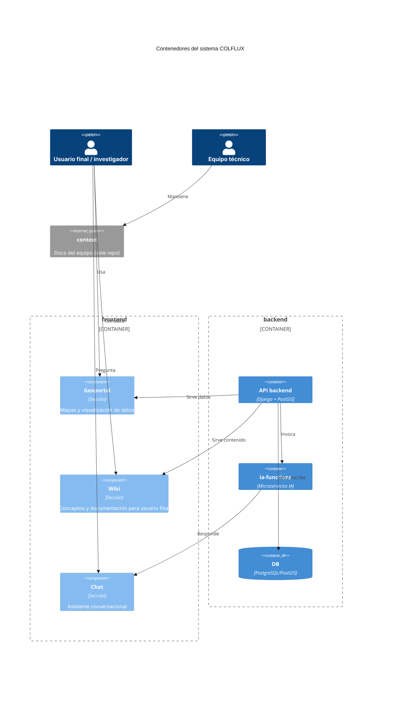

# Diagrama C4

Misma información que el [diagrama de integración de Repositorios](repositorios.md), en notación **C4 formal** (nivel Contenedor), para quien prefiera ese estándar.

_Clic sobre el diagrama para ampliarlo a pantalla completa · Esc para cerrar._

