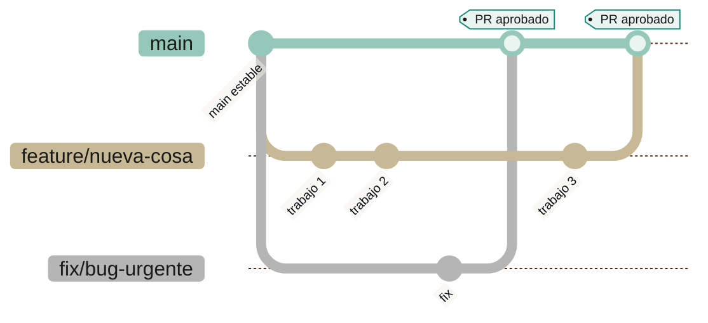

# Git: conceptos y acuerdos de flujo de trabajo

## ¿Qué es Git?

Git es un **sistema de control de versiones distribuido**: una herramienta que guarda el historial completo de los cambios hechos a un conjunto de archivos (código, en general), permite volver a cualquier punto anterior, y permite que varias personas trabajen sobre el mismo proyecto en paralelo sin pisarse el trabajo.

"Distribuido" es la palabra clave: cada persona que clona un repositorio tiene una copia completa de todo el historial en su propia máquina, no solo los archivos de la versión actual. No depende de estar conectado a un servidor central para poder trabajar, ver el historial o crear una nueva rama.

## De dónde viene y por qué se creó

Git lo creó **Linus Torvalds** en **2005**, el mismo creador del kernel de Linux. El proyecto Linux usaba hasta entonces una herramienta propietaria llamada **BitKeeper**, cedida gratis a la comunidad open source. Cuando la empresa dueña de BitKeeper retiró esa licencia gratuita, el proyecto se quedó sin herramienta de control de versiones de un día para otro, y Torvalds escribió Git en pocas semanas para reemplazarla.

Los objetivos de diseño, marcados por ese origen, explican por qué Git es como es:

- **Velocidad** — el kernel de Linux es enorme y con miles de colaboradores; las operaciones tenían que ser rápidas incluso a esa escala.
- **Distribuido** — sin un único servidor central del que todo dependa (a diferencia de herramientas anteriores como CVS o Subversion/SVN, donde sin conexión al servidor no se podía casi nada).
- **Fuerte soporte para ramas y trabajo no lineal** — miles de colaboradores trabajando en paralelo, en features distintas, que luego convergen.
- **Integridad de los datos** — cada cambio queda identificado con un hash (SHA-1) que depende de todo el historial anterior; si algo se corrompe o se altera, se puede detectar.

Antes de Git, la norma eran sistemas **centralizados** (CVS, Subversion): existía un único servidor con el historial "real", y cada persona solo tenía la versión de archivos en la que estaba trabajando, no el historial completo. Git (y los distribuidos que lo precedieron, como Mercurial o BitKeeper mismo) cambiaron ese modelo.

## Conceptos base

| Término | Qué es |
|---|---|
| **Repositorio (repo)** | La carpeta del proyecto más todo su historial de cambios (guardado en la subcarpeta oculta `.git/`). |
| **Commit** | Una "fotografía" guardada del estado de los archivos en un momento dado, con un mensaje que explica qué cambió y por qué. Es la unidad mínima de historial. |
| **Rama (branch)** | Una línea de desarrollo independiente. Permite trabajar en algo (una funcionalidad, un fix) sin afectar el código de otras ramas hasta que se decide unir el trabajo. |
| **Remoto (remote)** | Una copia del repositorio alojada en otro lugar (típicamente GitHub) usada para compartir el trabajo con el resto del equipo. El remoto más común se llama `origin`. |
| **Clone** | Descargar una copia completa de un repositorio remoto (historial incluido) a la máquina local. |
| **Push / Pull** | Subir (`push`) los commits locales al remoto, o traer (`pull`) los commits que otras personas subieron al remoto hacia la máquina local. |
| **Merge** | Unir el historial de una rama dentro de otra (por ejemplo, incorporar los cambios de `feature/x` a `main`). |
| **Conflicto (merge conflict)** | Cuando dos ramas cambiaron la(s) misma(s) línea(s) de un archivo de forma distinta y Git no puede decidir solo cómo combinarlas — requiere que una persona elija manualmente. |

**Git ≠ GitHub.** Git es la herramienta de control de versiones (funciona sin internet, sin cuenta, sin plataforma). GitHub es un **servicio** que aloja repositorios Git en la nube y agrega funcionalidad encima: interfaz web, Pull Requests, revisión de código, control de acceso, GitHub Actions (automatización), etc. COLFLUX usa Git como herramienta y GitHub como plataforma donde viven los repositorios remotos de la organización.

**Pull Request (PR)** — no es un concepto de Git en sí, sino de plataformas como GitHub: es una solicitud formal de "quiero unir los cambios de mi rama a otra rama", que además sirve como espacio para que otras personas revisen el código antes de que se una.

## Modelos de ramas: dos enfoques comunes

Existen distintas convenciones sobre cómo organizar las ramas de un proyecto. Dos de las más conocidas:

- **Git Flow clásico**: agrega una rama `develop` como capa de integración entre las funcionalidades en desarrollo y `main`. `main` solo se actualiza en releases formales. Pensado para proyectos con ciclos de release largos y programados.
- **GitHub Flow**: una única rama larga (`main`), que se asume siempre desplegable. Todo lo demás son ramas cortas (`feature/*`, `fix/*`) que nacen de `main` y vuelven a `main` vía Pull Request. Pensado para equipos que despliegan seguido (varias veces por semana o por día).

Cuál conviene depende del proyecto — no hay una respuesta universal. La sección siguiente son los acuerdos que aplican hoy en COLFLUX, pero son eso, acuerdos: algo que se define y revisa en equipo, no una regla fija de Git.

---

## Acuerdos del equipo (a validar)

Lo de aquí en adelante es una propuesta concreta para COLFLUX, no un concepto de Git — está sujeto a revisión y acuerdo con el resto del equipo antes de darlo por definitivo.

### Modelo elegido: GitHub Flow

Los workflows de despliegue automático ya existentes (`backend`, `frontend`, y el que se está armando en `ia-functions`) disparan cuando un PR se mergea a `main` (ver [Entregables de la tarea de despliegue](../../personal/tasks/inprogress/automatizar-deploy-ecosistema-colflux.md)). Meter una rama `develop` de por medio rompería ese disparador — habría que decidir cuándo `develop` se promueve a `main`. Propuesta: usar **GitHub Flow**, sin `develop`, y revisar esta decisión si el equipo crece o se necesita un ambiente de *staging* real.

| Rama | ¿Protegida? | Propósito |
|---|---|---|
| `main` | Sí | Siempre desplegable. Es lo que corre en `44.213.47.34`. Todo cambio entraría solo vía Pull Request aprobado. |
| `feature/<nombre-corto>` | No | Una funcionalidad nueva. Nace de `main`, vive días (no semanas), muere al mergear. |
| `fix/<nombre-corto>` | No | Corrección de un bug, urgente o no. Mismo ciclo que `feature/*`. |

Sin rama `develop`. Sin ramas de larga vida aparte de `main`.

### Flujo paso a paso propuesto

1. **Actualizar `main` local** antes de empezar: `git checkout main && git pull`.
2. **Crear la rama** desde `main`: `git checkout -b feature/nombre-corto` (o `fix/nombre-corto`).
   - Nombre corto, consistente con el repo, sin espacios: `feature/chat-integration`, `fix/vite-base-path`.
3. **Trabajar y commitear** en esa rama. Push frecuente para no perder trabajo: `git push -u origin feature/nombre-corto`.
4. **Abrir el Pull Request** contra `main` en GitHub. Descripción breve: qué cambia y por qué.
   - ⚠️ Verificar que la rama parte de la punta real de `origin/main` y no de otra rama de trabajo en curso (bug real que pasó el 2026-09-11 con el PR #6 de `frontend`: se creó por error desde otra rama en curso y arrastró un commit ajeno).
5. **Esperar revisión y aprobación** antes de mergear (quién aprueba, y con qué criterio, es parte de lo que falta acordar con el equipo).
6. **Mergear el PR.** En cuanto se mergea a `main`, el workflow de despliegue de ese repo (si existe) dispara solo.
7. **Borrar la rama** ya mergeada.

Un fix urgente en producción seguiría el mismo flujo (`fix/*` → PR → aprobación → merge a `main` → deploy automático), sin atajos.

### Protección de ramas (propuesta, sin aplicar todavía)

Configuración a evaluar en GitHub, por repositorio, sobre la rama `main` (y `master` en los repos donde ese sea el nombre por defecto):

- **Require a pull request before merging** — nadie haría `git push` directo a `main`.
- **Require approvals** — cuántas aprobaciones y de quién(es) es justo lo que falta definir en equipo.
- **Require conversation resolution before merging** — evita mergear con comentarios de revisión sin resolver.
- **Do not allow force pushes** / **Do not allow deletions** sobre `main`.

Repositorios donde aplicaría, una vez acordado: `backend`, `frontend`, `ia-functions`, `context`, `wiki`. No requiere tocar ningún workflow — es configuración de GitHub, no de `.github/workflows/`.

## Referencias

- [Repositorios](repositorios.md) — inventario de repos de COLFLUX.
- [DevOps y CI/CD](../conceptos/devops.md) — conceptos base (pipeline, workflow, trigger) usados en los despliegues automáticos.
- [Guía: levantar el ecosistema COLFLUX](guia-desarrollo-local.md) — cómo correr cada repo localmente antes de abrir un PR.
- `personal/tasks/inprogress/automatizar-deploy-ecosistema-colflux.md` — tarea donde nació esta documentación.
- [Pro Git — capítulo "Getting Started"](https://git-scm.com/book/en/v2/Getting-Started-About-Version-Control) — historia y fundamentos, versión libre y oficial del libro.
- [GitHub Docs — About protected branches](https://docs.github.com/en/repositories/configuring-branches-and-merges-in-your-repository/managing-protected-branches/about-protected-branches)
