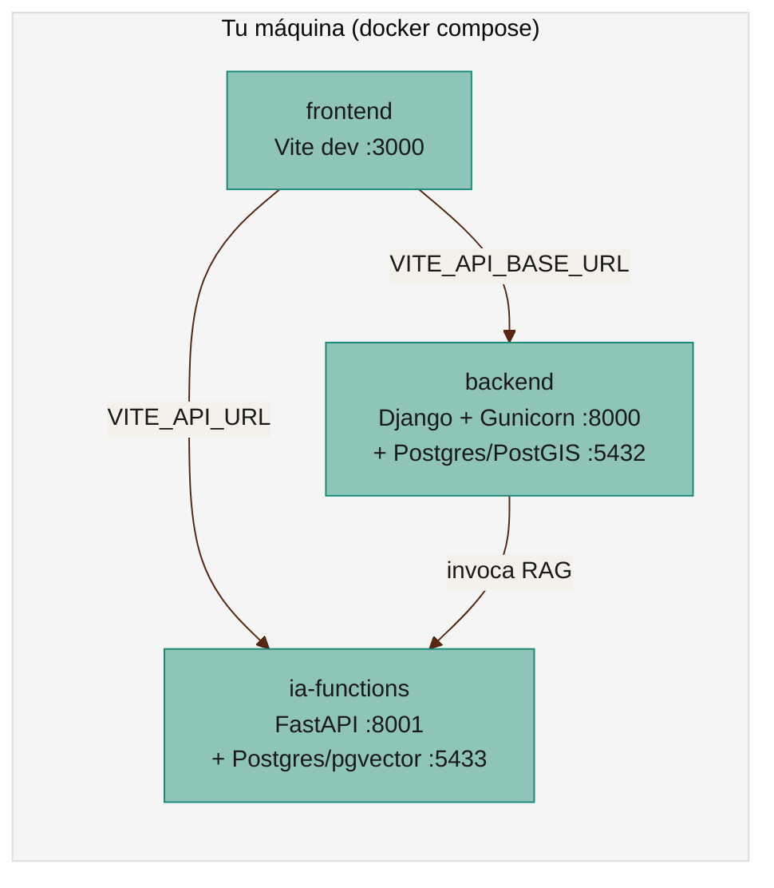

# Guía: levantar el ecosistema COLFLUX

Cómo arrancar cada repositorio en tu máquina, en el orden correcto, y cómo se conectan entre sí. Pensada para dos lectores: una persona que va a modificar código y necesita ver el cambio corriendo antes de abrir un PR, y un agente de IA que necesita el contexto completo sin tener que descubrirlo leyendo cinco `README.md` distintos.

Antes de tocar código, revisar [Git: conceptos y acuerdos de flujo de trabajo](git-flow.md): todo cambio va en una rama `feature/*`/`fix/*` y entra a `main` vía Pull Request aprobado.

## Requisitos previos

- **Docker y Docker Compose** — todos los servicios corren en contenedores, en local y en producción. No hace falta instalar Python, Node ni Postgres a mano.
- **Git** con acceso a la organización `colflux` en GitHub.
- Puertos libres en `localhost`: `8000` (backend), `8001` (ia-functions), `3000` (frontend dev), `5432`/`5433` (bases de datos).

## Mapa del ecosistema



Los tres servicios son independientes entre sí (cada uno con su propio `docker-compose.yml`), pero el `frontend` necesita que `backend` e `ia-functions` estén arriba para funcionar completo. Si solo vas a tocar uno, no hace falta levantar los otros dos — solo ten en cuenta qué llamadas van a fallar (ver tabla de variables más abajo).

## 1. `backend` (Django + PostGIS)

```bash
git clone https://github.com/colflux/backend.git
cd backend
docker compose up --build
```

Esto levanta:

- `db` — Postgres/PostGIS en `localhost:5432` (usuario/clave/DB por defecto: `ghg`/`ghg`/`ghg`, ver `docker-compose.yml`).
- `web` — Django corriendo migraciones, `generate_catalogo` y `collectstatic` automáticamente, luego Gunicorn en `localhost:8000`.

No hace falta `.env` para desarrollo local — todas las variables tienen default de desarrollo en `docker-compose.yml` (`DATABASE_URL`, `DJANGO_SECRET_KEY`, `DJANGO_DEBUG=1`, etc.). Solo se necesita un `.env` real (copiado de `.env.example`) para producción.

Verificar que quedó arriba:

- API: `http://localhost:8000/api/geo/sitios/`
- Admin: `http://localhost:8000/admin/` (crear superusuario con `docker compose exec web python manage.py createsuperuser`, o definir `DJANGO_SUPERUSER_*` en el entorno antes de levantar)

## 2. `ia-functions` (FastAPI + RAG)

```bash
git clone https://github.com/colflux/ia-functions.git
cd ia-functions
cp .env.example .env
# Completar al menos GROQ_API_KEY (https://console.groq.com), o cambiar
# LLM_PROVIDER a "gemini" / "ollama" / "anthropic" con su respectiva key.
docker compose up -d db api
```

Esto levanta:

- `db` — Postgres con `pgvector` en `localhost:5433` (puerto distinto al del backend para no chocar).
- `api` — FastAPI en `localhost:8001`, con `POST /ingest` y `POST /chat`.

Si se quiere correr el modelo localmente sin depender de una API externa:

```bash
docker compose --profile ollama up -d db api ollama
docker compose exec ollama ollama pull llama3.1
# y en .env: LLM_PROVIDER=ollama
```

Verificar: `GET http://localhost:8001/health`.

## 3. `frontend` (React + Vite)

```bash
git clone https://github.com/colflux/frontend.git
cd frontend
cp .env.example .env   # define VITE_API_URL (default apunta a ia-functions en :8001)
docker compose --profile dev up
```

Esto levanta un contenedor Node con hot reload en `localhost:3000`, apuntando por defecto a:

- `VITE_API_BASE_URL=http://localhost:8000/api` (backend)
- `VITE_GEO_API_URL=http://localhost:8000/api/geo/sitios/` (backend)
- `VITE_API_URL=http://localhost:8001` (ia-functions, para el chat)

Si `backend` y/o `ia-functions` no están corriendo, el frontend sigue funcionando pero esas secciones (mapa, chat) van a fallar sus llamadas — normal si solo estás trabajando en UI que no depende de datos reales.

Alternativa sin Docker (más rápida para iterar en UI pura): `npm install && npm run dev`.

## Variables de entorno que conectan los servicios

| Variable | Dónde vive | Apunta a | Nota |
|---|---|---|---|
| `VITE_API_BASE_URL` | `frontend` | `backend` (`/api`) | Se incrusta en el bundle en build-time (Vite) — cambiarla requiere rebuild, no solo reiniciar. |
| `VITE_GEO_API_URL` / `VITE_GEO_API_BASE_URL` | `frontend` | `backend` (`/api/geo/...`) | Ídem, build-time. |
| `VITE_API_URL` | `frontend` | `ia-functions` (`/chat`, `/ingest`) | Ídem, build-time. Hoy en producción sigue con el placeholder `http://localhost:8001` porque `ia-functions` aún no está desplegado ahí. |
| `LLM_PROVIDER` + su API key | `ia-functions` | Proveedor de LLM externo (Groq, Gemini, Ollama, Anthropic) | Cambiable sin tocar código. |
| `DATABASE_URL` | `backend` | Su propia base Postgres/PostGIS | No confundir con la base de `ia-functions` (son bases distintas, puertos distintos). |

## Cómo correr el ecosistema completo a la vez

Cada repo vive en su propia carpeta con su propio `docker-compose.yml` — no hay un compose único que levante los tres. Para probar el flujo end-to-end en local:

```bash
# terminal 1
cd backend && docker compose up --build

# terminal 2
cd ia-functions && docker compose up -d db api

# terminal 3
cd frontend && docker compose --profile dev up
```

Abrir `http://localhost:3000`.

## Cómo corre esto en producción (para contexto, no para reproducir a mano)

Todo vive en el mismo servidor Lightsail (`44.213.47.34`), cada repo en su propia carpeta bajo `/home/ubuntu/colflux/<repo>/`, cada uno con su `docker compose` propio. `nginx` en el puerto `80` enruta el tráfico real:

| Ruta | Servicio | Puerto interno |
|---|---|---|
| `/` | `frontend` (`prod`, build estático servido por Nginx del contenedor) | `127.0.0.1:3000` |
| `/api/`, `/admin/`, `/static/`, `/media/`, `/docs/` | `backend` | `127.0.0.1:8001` |
| _(pendiente)_ | `ia-functions` | `127.0.0.1:8001` del contenedor propio — **puerto duplicado con `backend`, revisar al desplegar** |

El despliegue a este servidor es automático: cada PR mergeado a `main` dispara un workflow de GitHub Actions que hace `git reset --hard origin/main` + `docker compose build` + `docker compose up -d --wait` en el servidor, vía SSH. No se edita código a mano en el servidor — solo el `.env` de cada repo, que nunca se pisa con `git pull`. Detalle completo en `personal/tasks/inprogress/automatizar-deploy-ecosistema-colflux.md`.

⚠️ Nota para quien despliegue `ia-functions`: su `docker-compose.yml` local publica la API en `8001` por defecto (`WEB_PORT:-8001`), el mismo puerto que ya usa `backend` en el servidor — hay que fijar un `WEB_PORT` distinto en el `.env` de producción de `ia-functions` antes de desplegar, o van a chocar.

## Para un agente de IA trabajando en este ecosistema

- No asumas que los tres servicios están corriendo — revisa con `docker compose ps` en cada carpeta antes de asumir que una llamada a la API va a funcionar.
- Las variables `VITE_*` del frontend son de build-time: cambiarlas en `.env` y solo reiniciar el contenedor **no** tiene efecto, hay que reconstruir (`docker compose build` de nuevo).
- Nunca hagas push directo a `main` en ningún repo — todos están (o van a estar) protegidos, ver [Git: conceptos y acuerdos de flujo de trabajo](git-flow.md). Trabaja siempre en una rama `feature/*`/`fix/*` y abre PR.
- Antes de crear una rama, verifica que partes de la punta real de `origin/main` (`git fetch && git checkout -b feature/x origin/main`) — un PR contaminado con commits de otra rama ya pasó una vez en `frontend` (ver Historial de la tarea de despliegue).
- Si necesitas reproducir el entorno de producción para depurar algo, la IP es `44.213.47.34` y las rutas de cada repo en el servidor están en `personal/tasks/inprogress/automatizar-deploy-ecosistema-colflux.md` — no inventes rutas ni puertos, están documentados ahí.

## Referencias

- [Git: conceptos y acuerdos de flujo de trabajo](git-flow.md) — cómo se rama, revisa y mergea el código antes de llegar a este punto.
- [Repositorios](repositorios.md) — inventario e integración de los repos.
- [DevOps y CI/CD](../conceptos/devops.md) — conceptos de pipeline/workflow usados en el despliegue automático.
- `personal/tasks/inprogress/automatizar-deploy-ecosistema-colflux.md` — estado real y detallado del despliegue a producción.
