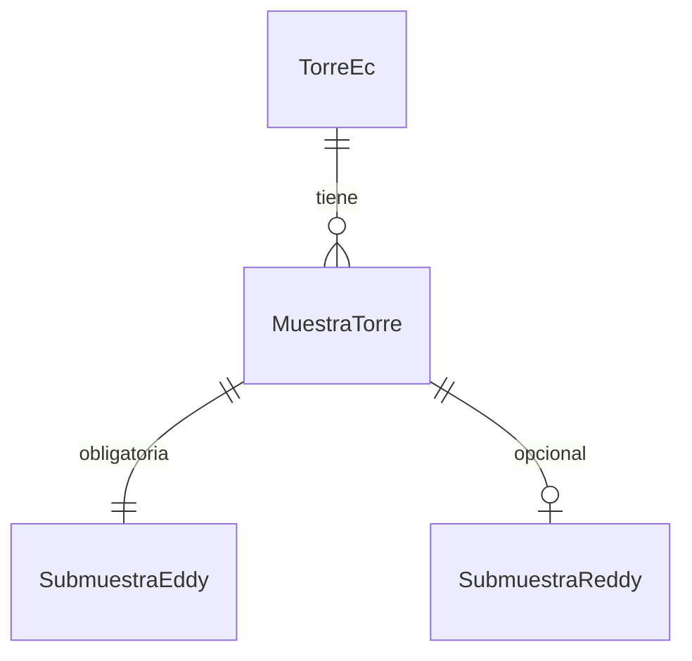

# Modelo de datos: series de tiempo de torre EC (propuesta)

**Estado:** propuesta, pendiente de validar con el equipo de backend — no implementada todavía.

## Contexto

El modelo actual del catálogo GEI (`backend/app/models/co2.py`, `backend/app/models/torre.py`) tiene dos piezas relacionadas con torres, pero ninguna cubre datos de flujo en serie de tiempo:

- `TorreEc` / `ConfiguracionSensorGas` — metadatos **fijos** de instalación (alturas, frecuencia de adquisición, separaciones del sensor). No son mediciones.
- `MuestraGEI` / `SubmuestraGEI` — mediciones **manuales por cámara**: una sesión (`MuestraGEI`, un tubo conectado a un analizador en una unidad de muestreo) con ~4 tomas (`SubmuestraGEI`), cada una con momento inicio/final y condición de luz día/noche/noche simulada.

Al revisar un archivo real de salida de Eddypro de la torre Guatavita ST2 (169 columnas, una fila cada 30 minutos — ver [Datos de torres EC: de Eddypro a ReddyProc](../conocimiento/datos-torres-eddypro-reddyproc.md)) se encontró que `MuestraGEI`/`SubmuestraGEI` no tiene dónde guardar los flujos (`co2_flux`, `ch4_flux`, `h2o_flux`, `H`, `LE`), sus flags de calidad, la turbulencia (`u*`) ni el footprint — son datos de otra naturaleza (serie continua semihoraria, sin "tomas" ni condición de luz discreta). Detalle completo del mapeo columna por columna en la tarea [[datos-modelado-carga-torres]].

**Decisión ya tomada:** se sube a la plataforma la salida de **Eddypro** como dato primario y obligatorio por torre; la salida de **ReddyProc** (gap-filling + partición NEE/Reco/GPP) se trata como un dato derivado y opcional, porque no todas las torres necesariamente la van a tener corrida de forma comparable. Justificación completa en la sección "Integración en Colflux" de [Datos de torres EC: de Eddypro a ReddyProc](../conocimiento/datos-torres-eddypro-reddyproc.md).

## Entidades propuestas

Tres entidades nuevas, inspiradas en el patrón sesión/toma de `MuestraGEI`/`SubmuestraGEI`, pero adaptadas: aquí no hay tomas repetidas, sino dos niveles de procesamiento (Eddypro y ReddyProc) del mismo instante semihorario.

### `MuestraTorre`

Ancla de identidad del registro semihorario: torre + instante de tiempo.

| Campo | Tipo | Notas |
|---|---|---|
| `torre` | FK → `TorreEc` | `on_delete=CASCADE` |
| `fecha` | DateField | |
| `hora` | TimeField | |

`unique_together = [("torre", "fecha", "hora")]`.

### `SubmuestraEddy`

Obligatoria (1:1 con `MuestraTorre`): los datos de salida de Eddypro para ese instante.

| Grupo | Campos |
|---|---|
| Flujos + calidad | `co2_flux`/`qc_co2_flux`/`rand_err_co2_flux`, igual para `ch4_flux`, `h2o_flux`, `h_flux` (calor sensible), `le_flux` (calor latente), `tau` |
| Turbulencia | `ustar`, `tke`, `monin_obukhov_length`, `bowen_ratio` |
| Footprint | `footprint_x_peak`, `footprint_x_70`, `footprint_x_90` |
| Aire / viento | `air_temperature`, `air_pressure`, `relative_humidity`, `vpd`, `air_density`, `wind_speed`, `wind_dir` |
| Resto | `datos_extra` (JSONField, opcional) — varianzas/covarianzas, spikes, diagnósticos propios de LI-7200/LI-7700, sin modelar columna por columna todavía |

### `SubmuestraReddy`

Opcional (0:1 con `MuestraTorre`) — puede no existir si la torre no tiene ReddyProc corrido.

| Campo | Notas |
|---|---|
| `nee_f` | NEE con gap-filling |
| `nee_fqc` | flag de calidad del gap-filling |
| `reco` | respiración del ecosistema |
| `gpp_f` | productividad primaria bruta |
| `ustar_used` | umbral de u* usado en el filtrado |
| `datos_extra` | JSONField, opcional, resto de columnas |

## Por qué esta forma

- **3 entidades, no 1 ni 4.** Una sola tabla con todo mezclaría dos obligatoriedades distintas (Eddypro siempre, ReddyProc a veces) y dejaría columnas `null` sistemáticamente según el tipo. Cuatro entidades (un par `Muestra`/`Submuestra` independiente por cada software) obligaría a ligar `SubmuestraReddy` a una fila específica de procesamiento de Eddypro, lo cual es más rígido de lo necesario: lo que importa es que ambas describan el mismo instante de la torre, no qué corrida específica de Eddypro se usó.
- **`SubmuestraReddy` opcional, no un segundo registro independiente.** Refleja directamente la regla de negocio: *si existe ReddyProc para un instante, necesariamente existe Eddypro para ese mismo instante* (ReddyProc es postprocesamiento de Eddypro, nunca un dato independiente).
- **`datos_extra` como JSONField.** Evita tener que modelar las ~169 columnas de Eddypro una por una desde el inicio; los campos explícitos son los que ya se identificaron como necesarios para consulta/reportes (flujos, calidad, turbulencia, footprint, meteorología básica). Se puede ir promoviendo campos de `datos_extra` a columnas propias si se vuelven necesarios para filtrar/agregar.
- **`MuestraGEI`/`SubmuestraGEI` no se tocan.** Siguen siendo exclusivamente para mediciones manuales por cámara; no se reutilizan para torres porque la semántica de "toma" día/noche no aplica a una serie continua.

## Pendiente

- Validar esta propuesta con el equipo de backend antes de implementarla.
- Completar la sección de ReddyProc en [Datos de torres EC: de Eddypro a ReddyProc](../conocimiento/datos-torres-eddypro-reddyproc.md) cuando se tenga el archivo real de ReddyProc (`Guatavita_2_ReddyProc_2023_2024_output (1).csv`, aún no descargado en `files/archivos-torres/`), para confirmar que `SubmuestraReddy` cubre sus columnas reales.
- Definir a qué categoría del catálogo (`app/catalogo/generator.py`) pertenecerían estas entidades — probablemente una nueva o una extensión de "Torre EC y Flujos".

## Referencias

- [[datos-modelado-carga-torres]] — tarea donde se originó esta propuesta, con el mapeo columna por columna.
- [Datos de torres EC: de Eddypro a ReddyProc](../conocimiento/datos-torres-eddypro-reddyproc.md) — qué es cada archivo y por qué se sube Eddypro.
- `backend/app/models/torre.py`
- `backend/app/models/co2.py`
