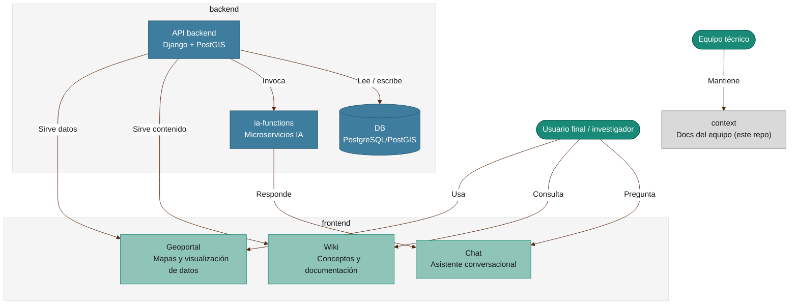

# Repositorios

Cómo se integran los repositorios de COLFLUX: el sistema en ejecución (frontend + backend) y `context` como documentación del equipo alrededor. El detalle de cada repo está en la tabla más abajo.

_Clic sobre el diagrama para ampliarlo a pantalla completa · Esc para cerrar._

## Repositorios

Inventario de los repositorios que conforman COLFLUX, según lo encontrado en la carpeta local `colflux/` a fecha 2026-08-27.

| Repositorio | URL | Propósito | Estado |
|---|---|---|---|
| **backend** | [github.com/colflux/backend](https://github.com/colflux/backend) | API Django + PostGIS. Modela, ingiere (ETL Excel/CSV) y expone datos de flujo de gases de efecto invernadero (CO₂, CH₄, N₂O), catálogos geográficos (región/departamento/municipio/vereda) y geoportal en GeoJSON. | Activo |
| **frontend** | [github.com/colflux/frontend](https://github.com/colflux/frontend) | Geoportal web (React + TypeScript + Vite). Visualización de datos geoespaciales sobre MapLibre, drill-down geográfico, filtros y exportación a Excel. | Activo |
| **context** _(este repo)_ | [github.com/colflux/context](https://github.com/colflux/context) | Documentación transversal del equipo (OE2): requisitos, arquitectura, gestión, marca. Sirve como contexto para trabajar con IA. | Activo |
| **wiki** | [github.com/colflux/wiki](https://github.com/colflux/wiki) | Wiki de cara al **usuario final**: datos y contexto del proyecto, explicación de los flujos de carbono, guías de uso. Distinto propósito de `context` (que es para el equipo). | Activo — **pendiente revisar contenido y evaluar qué migrar/reorganizar respecto a `context`** |
| **ia-functions** | [github.com/colflux/ia-functions](https://github.com/colflux/ia-functions) | Microservicios de IA, invocados por `backend`. Conceptualmente es parte del backend, pero vive en repo propio para desplegarse/escalar por separado. Sin commits todavía. | Inicial / vacío |
| **ia** | _(sin repo en GitHub)_ | Carpeta local con notas de configuración (`line-model.md`). No es un repositorio git — evaluar si debe convertirse en uno o su contenido debe moverse a otro repo. | Sin versionar |

Ver también: [Diagrama C4](diagrama-c4.md) (misma información, en notación C4 formal).

## Notas

- Todos los repos con remoto están bajo la organización `colflux` en GitHub.
- Esta tabla se actualiza a mano por ahora; si el equipo crece en número de repos, considerar generarla desde la API de GitHub.
- **`frontend`** integra tres secciones: **Geoportal** (mapas y datos), **Wiki** (conceptos y documentación de usuario final) y **Chat** (asistente conversacional). Geoportal y Wiki son servidas por la API del backend; Chat es respondido por `ia-functions`.
- **`ia-functions`** es conceptualmente parte del backend — microservicios de IA invocados por la API — pero vive en un repo propio porque se despliega/escala por separado.
- **Pendiente de definir:** de dónde saca su contenido la sección Wiki — si consulta una base de datos como fuente única de verdad, o si el contenido vive en otro lugar (posiblemente relacionado con el repo `wiki`, ver tabla arriba). Actualizar este diagrama cuando se decida.
- `context` no es parte del sistema en ejecución — es documentación del equipo. Se muestra aparte porque el equipo lo mantiene y consulta, pero no hay integración en tiempo de ejecución con `frontend`/`backend`.
- `ia` (carpeta local sin repo git) no aparece en el diagrama porque no es un sistema ni repositorio todavía.
