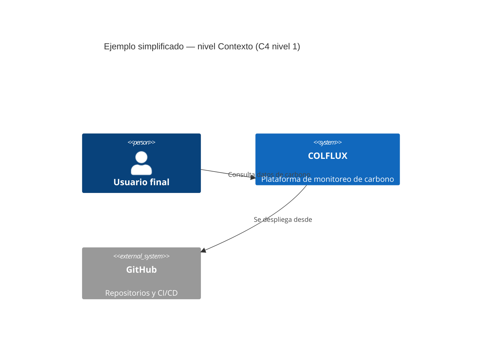

# Arquitectura

Conceptos de arquitectura de software, pensados para que cualquier persona del equipo (técnica o no) entienda qué implica diseñar bien una plataforma como COLFLUX. Para las decisiones técnicas *reales* del proyecto, ver [Arquitectura del proyecto](../arquitectura/index.md).

## Cómo se diseña una plataforma

Pasos típicos, en orden de dependencia (cada uno se apoya en el anterior):

1. **Entender el problema y los usuarios** — quién usa la plataforma, qué necesita lograr.
2. **Requisitos funcionales y no funcionales** — qué debe hacer, y qué tan bien (rendimiento, escala, seguridad, disponibilidad).
3. **Arquitectura de software** — en qué piezas se divide el sistema y cómo se comunican.
4. **Elección de tecnología** por pieza — lenguaje, framework, base de datos — justificada por los requisitos.
5. **Arquitectura de infraestructura** — dónde corre cada pieza, cómo se despliega, cómo se monitorea.
6. **Decisiones registradas** (ADR) — cada decisión importante con su alternativa descartada y el porqué.
7. **Iteración** — la plataforma rara vez se diseña completa de una vez; se valida con lo construido y se ajusta.

En COLFLUX esto se refleja en la estructura de la documentación: `requisitos/` → `arquitectura/` (software, y pronto infraestructura) → `conceptos/` como guía de por qué se hacen las cosas así.

## ¿Qué es arquitectura de software?

Es el conjunto de decisiones estructurales de un sistema: en qué partes se divide, cómo se comunican esas partes, y qué tecnología usa cada una. No es el código en sí — es el "plano" que explica por qué el código está organizado como está.

Una buena arquitectura no es la más sofisticada, sino la que resuelve los requisitos actuales sin bloquear los cambios previsibles. Por ejemplo, separar el geoportal (frontend) de la API (backend) permite escalarlos, desplegarlos y probarlos por separado.

📖 [Software Architecture — Martin Fowler](https://martinfowler.com/architecture/)

## Arquitectura de software vs. arquitectura de infraestructura

Dos preguntas distintas que suelen mezclarse:

- **Arquitectura de software**: cómo se divide el *sistema* en partes (servicios, módulos, capas), qué responsabilidad tiene cada una y cómo se comunican entre sí. Ej. "el geoportal consume datos de la API vía HTTP; la API delega las respuestas del chat a `ia-functions`".
- **Arquitectura de infraestructura**: dónde y cómo *corre* ese software en el mundo real — servidores, contenedores, redes, dominios, CI/CD, secretos, monitoreo. Ej. "el backend corre en un contenedor Docker desplegado en Render; la base de datos es PostgreSQL gestionado; el deploy se dispara desde GitHub Actions".

La diferencia importa porque cambian a ritmos distintos y las decide gente distinta: la arquitectura de software se define pensando en requisitos y responsabilidades (encaja con [Requisitos](../requisitos/index.md)), mientras que la de infraestructura se define pensando en costo, disponibilidad y operación. Un mismo diagrama de software (ej. "backend habla con DB") puede implementarse sobre infraestructuras muy distintas sin cambiar una línea de código.

En COLFLUX, esta distinción se refleja en [Arquitectura del proyecto](../arquitectura/index.md): el diagrama de [Repositorios](../arquitectura/repositorios.md) y el [C4](../arquitectura/diagrama-c4.md) documentan la arquitectura de **software** (contenedores y su comunicación); la arquitectura de **infraestructura** (hosting, despliegue, dominios) todavía está por documentar ahí mismo, en una sección aparte.

## El modelo C4

Forma de dibujar la arquitectura de un sistema en **4 niveles de zoom**, del más general al más detallado. La idea es que cada nivel sirve a una audiencia distinta — no hace falta un solo diagrama gigante que lo explique todo.

| Nivel | Nombre | Responde | Audiencia |
|---|---|---|---|
| 1 | **Contexto** | ¿Quién usa el sistema y con qué otros sistemas se conecta? | Cualquiera (técnico o no) |
| 2 | **Contenedores** | ¿De qué aplicaciones/servicios/bases de datos está hecho? | Equipo técnico y gestión |
| 3 | **Componentes** | ¿Cómo se divide internamente cada contenedor? | Desarrolladores del contenedor |
| 4 | **Código** | Clases, funciones — el detalle de implementación | Desarrolladores (rara vez se dibuja a mano) |

**Ejemplo real del proyecto:** el [diagrama de integración de COLFLUX](../arquitectura/repositorios.md) está a nivel Contenedor (nivel 2) — muestra `frontend`, `backend`, la base de datos y `ia-functions` como piezas separadas, sin entrar en las clases o funciones de cada una.

📖 [C4 Model — sitio oficial](https://c4model.com/)

## Historias de usuario (user stories)

Forma breve de describir un requisito desde el punto de vista de quien lo usa, en lugar de describir directamente la solución técnica. Formato típico:

> **Como** \<tipo de usuario\>, **quiero** \<acción\>, **para** \<beneficio\>.

**Ejemplo:**

> Como investigador, quiero filtrar los datos de flujo de carbono por municipio, para analizar tendencias en una región específica sin descargar todo el dataset.

Sirven para mantener el foco en el problema del usuario antes de discutir la implementación. La arquitectura debería poder trazarse de vuelta a las historias de usuario que la justifican (por eso [Requisitos](../requisitos/index.md) y Arquitectura están separados pero conectados).

📖 [User Stories — Atlassian](https://www.atlassian.com/agile/project-management/user-stories)

## Actores y sistemas externos

- **Actor / persona**: quién interactúa con el sistema — un usuario humano (ej. investigador) o un rol (ej. equipo técnico). En C4 se dibuja como figura de "persona".
- **Sistema externo**: algo con lo que el sistema se integra pero que el equipo no controla ni desarrolla — ej. GitHub, un servicio de mapas, una API de terceros.

Identificarlos primero (nivel Contexto de C4) evita diseñar de adentro hacia afuera y ayuda a ver qué integraciones son realmente responsabilidad del proyecto.

## Requisitos funcionales vs. no funcionales

- **Funcional**: qué debe *hacer* el sistema. Ej. "el usuario puede exportar datos filtrados a Excel".
- **No funcional**: qué tan bien lo debe hacer. Ej. rendimiento (tiempo de respuesta), seguridad (autenticación), escalabilidad (usuarios concurrentes), disponibilidad.

Los requisitos no funcionales suelen ser los que más presionan la arquitectura: un requisito funcional casi siempre se puede resolver de varias formas, pero uno no funcional (ej. "debe soportar 10.000 usuarios concurrentes") descarta directamente ciertas decisiones técnicas.

📖 [Functional vs Non-functional Requirements — IBM](https://www.ibm.com/topics/functional-vs-non-functional-requirements)

## Decisiones de arquitectura (ADR)

Un **Architecture Decision Record** es un documento corto que registra una decisión técnica importante: qué se decidió, qué alternativas se consideraron y por qué se descartaron, y qué consecuencias trae. Evita que el equipo repita discusiones ya cerradas o pierda el contexto de por qué algo se hizo así.

En COLFLUX, esa idea vive en [Arquitectura del proyecto](../arquitectura/index.md) — cada decisión enlazada al requisito que la originó, en vez de un ADR por archivo separado.

📖 [ADR — GitHub adr repository](https://github.com/joelparkerhenderson/architecture-decision-record)

## Principios de un buen diseño

Ideas generales que ayudan a decidir "¿esto está bien diseñado?", independientemente de la tecnología:

- **Separación de responsabilidades**: cada parte del sistema hace una cosa (ej. el backend expone datos, el frontend los visualiza).
- **Acoplamiento bajo, cohesión alta**: las partes dependen lo mínimo posible unas de otras, pero lo que está dentro de una parte está relacionado entre sí.
- **YAGNI** (*You Aren't Gonna Need It*): no construir flexibilidad para requisitos hipotéticos que no existen todavía.
- **Trazabilidad**: poder responder "¿por qué el sistema está construido así?" señalando un requisito o decisión concreta, no una preferencia personal.

📖 [SOLID principles — DigitalOcean](https://www.digitalocean.com/community/conceptual-articles/s-o-l-i-d-the-first-five-principles-of-object-oriented-design)
