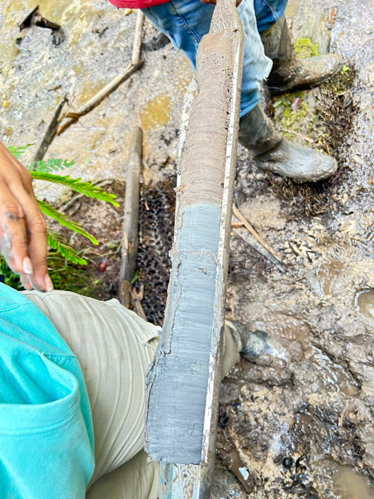
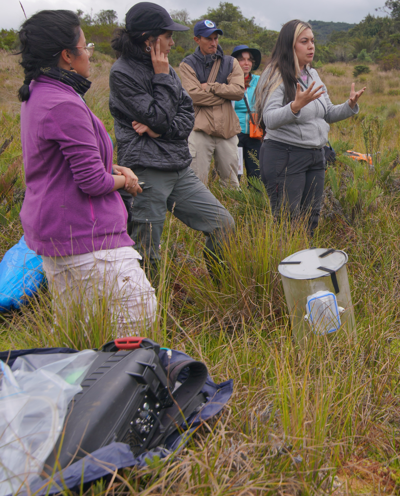

# FAQ: Interpretación de datos

Los datos disponibles en Colflux provienen de diversos equipos distribuidos en diferentes zonas de Colombia, lo que puede dificultar la forma en que entendemos la información. Este documento tiene como objetivo mostrar de forma breve y clara algunos conceptos clave, necesarios para poder enfrentarse a la información.  

!!! tip "Recuerda"
    Las bases de datos suelen contar con una tabla de vocabulario para que la busques y siempre estés informado.

## Carbono
### ¿Qué es el carbono?

El carbono es el sexto elemento de la tabla periódica. Es uno de los bloques más importantes para la formación de vida, y se encuentra en casi todos lados: en plantas, animales, el suelo, el agua, la atmosfera e incluso en nosotros. 

### ¿Cómo encontramos el carbono?

El carbono se puede encontrar en todo nuestro entorno. Cada vez que respiramos exhalamos dióxido de carbono, el cual sube a la atmosfera. De ahí, eventualmente es apropiado por las plantas, quienes respiran este mismo gas y lo utilizan para crecer y producir frutos. Eventualmente estos frutos caen al suelo, sirviendo de alimento para los animales que se encuentren allí. No todo es aprovechado fresco, por lo que ciertos frutos, hojas y ramas, caen al suelo, donde comienzan a descomponerse. Parte de este material que cae es integrado al suelo, donde puede acumularse y ser usado en futuros procesos. A su vez, puede que no todo caiga en el suelo, y en cambio, esas hojas y frutos caen en un cuerpo de agua, donde vuelven a ser alimento para los animales que allí habitan. De no ser aprovechados, esta materia orgánica puede sedimentar (irse al fondo) y queda como una reserva para futuros procesos. 

-*Fuente: Wikipedia - Ciclo del carbono.*

### ¿Por qué entender el carbono?

Actualmente tenemos un exceso de carbono en la atmosfera, sobre todo de gases de efecto invernadero que promueven el cambio climático. Entender procesos naturales que absorban, remuevan o fijen, como por ejemplo creación de madera, el crecimiento de pastos o la formación de suelo, son vital para enfrentar los efectos del cambio climático apropiándose del territorio.

## Biomasa

### ¿Qué es la biomasa aérea?

La biomasa aérea es solo la nomenclatura formal de decir el peso de las cosas vivas, que están por encima del suelo. Para este contexto, el concepto se usa para preguntarse cuanto pesan los árboles, arbustos y pastos que están dentro de un área específica, haciendo caso omiso al peso de animales y microorganismos.  

### ¿Qué datos se necesitan para obtener la biomasa?

Para obtener este valor en árboles es muy importante conocer el alto y ancho de cada uno, y si es posible la densidad de la madera. Esta información usualmente se encuentra con los títulos de Altura (m), DAP (Diámetro a la Altura del Pecho) del tronco en centímetros, y Densidad o "ρ" (rho minúscula). Luego, dependiendo de la zona en donde están los árboles, se utilizan ciertas ecuaciones que brindan el peso total. De ese peso, aproximadamente la mitad es carbono. Es importante aclarar que no siempre se tendrá la densidad en campo, pero esta puede ser obtenida de literatura.

Para pastos se suele recolectar una muestra que es pesada en un laboratorio. Esa muestra suele ser pesada húmeda (recién recolectada) y seca. 

### En biomasa, ¿qué es el tipo?

Cuando nos encontramos en la base de datos de biomasa con la información Tipo podemos encontrar 3 opciones: L, F, FG. Estos son descriptores del tamaño de un individuo.

- **L** es Latizal: un árbol cuyo tronco mide entre 5 y 20 cm de DAP.
- **F** es Fustal: un árbol cuyo tronco mide entre 20 y 50 cm de DAP.
- **FG** es Fustal grande: un árbol cuyo tronco mide más de 50 cm de DAP.

## Carbono Orgánico en el Suelo

### ¿Qué es el carbono orgánico en el suelo?

El carbono orgánico en el suelo (COS) se refiere a los compuestos orgánicos que se han depositado en el suelo, incluyendo residuos de plantas, animales, microorganismos, y el humus. El COS es esencial para la fertilidad y salud del suelo.

### ¿Por qué se obtiene el carbono en diferentes profundidades?

Obtener diferentes secciones de la misma columna de suelo permite hacer un análisis más controlado y minimiza el error. Asi mismo, las diferentes secciones de la columna pueden relatar eventos pasados y posibles disturbios en la zona. 

*Perfil del suelo.*

## Flujos de carbono (Cámaras)

### ¿Qué es la medida de flujos?

El flujo es la forma en la que se mide la liberación o secuestro del carbono gaseoso. El dióxido de carbono es uno de los alimentos más importantes de las plantas, por lo que suelen absorber carbono del aire a lo largo del día. Así mismo, el suelo y sus procesos de descomposición generan gases compuestos con carbono. Esta metodología nos permite entender el balance de estos procesos de liberacion y absorción de carbono de las plantas y de los suelos.

*Explicacion en campo del uso de la cámara de flujos*

### ¿Por qué tengo un valor negativo en flujos?

El flujo, sin importar de cuál gas se trate, representa el movimiento del gas desde el suelo (o el dosel) hacia la atmósfera. Si te encuentras con un valor de flujo negativo, esto significa que en ese momento el gas no está moviéndose hacia la atmósfera, y en cambio, este gas está siendo atrapado por el suelo, secuestrando carbono atmosférico.
