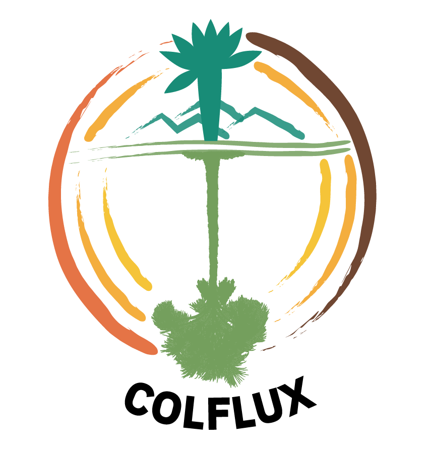
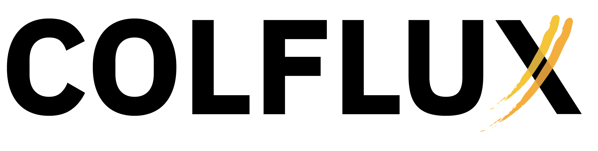
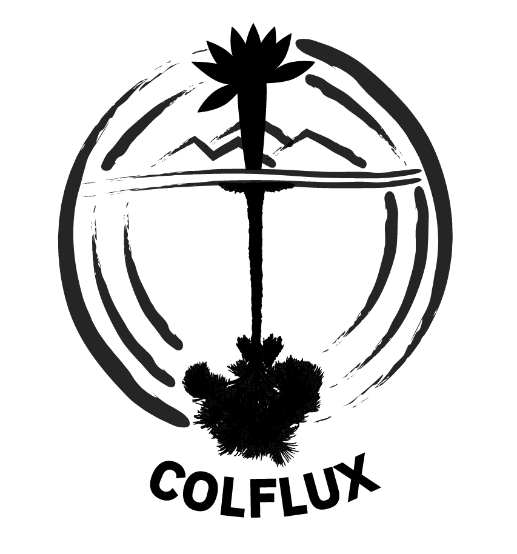
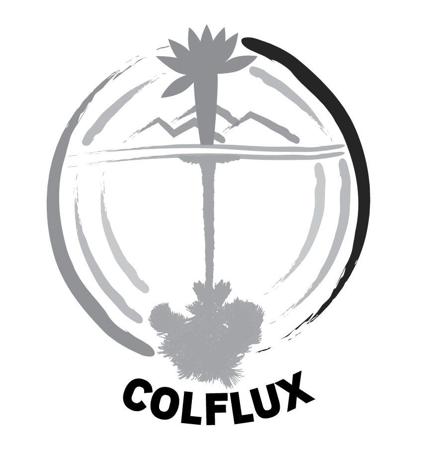

# Manual de identidad visual

_Transcrito del documento "01 - Manual_de_Marca_COLFLUX.pdf" subido al proyecto. Los archivos de logo originales están en `files/Manual de identidad visual y logos/`._

## Concepto

COLFLUX hace visible lo invisible: los flujos de carbono que conectan atmósfera, vegetación y suelo en ecosistemas estratégicos de Colombia. Representa la conexión entre los sistemas vivos y los procesos invisibles que sostienen la vida, como los flujos de carbono.

A través de la integración entre ciencia, tecnología, monitoreo participativo y conocimiento territorial, COLFLUX construye un sistema que permite observar, cuantificar y comprender el carbono, fortaleciendo el conocimiento para la toma de futuras decisiones.

Su identidad visual representa ese tránsito continuo entre procesos ecológicos, generación de conocimiento y acción colectiva en el territorio.

## Logotipo

{ width=280 }

El logotipo está compuesto por una serie de elementos gráficos que, en conjunto, representan la dinámica del carbono en ecosistemas estratégicos de Colombia:

- **Frailejón** (elemento superior) — ecosistema de páramo.
- **Montañas/suelo** — relieve transversal central.
- **Agua/suelos inundables** y **moriche** (elemento inferior) — ecosistema de morichal.
- **Círculo incompleto multicolor** — representa el ciclo del carbono como un proceso dinámico, continuo y no lineal. Su fragmentación sugiere la medición, la observación y la construcción progresiva del conocimiento científico.
- **Eje vertical central (verde)** — representa el flujo de carbono entre atmósfera, vegetación y suelo, a través de diferentes ecosistemas, funcionando como una columna de intercambio continuo.
- **Elementos superior e inferior (vegetación)** — captura de carbono (fotosíntesis). El elemento superior evoca ecosistemas de alta montaña (frailejón); el inferior remite a ecosistemas de tierras bajas (palma de moriche) — los ecosistemas de estudio del proyecto.

## Versiones y aplicaciones

| Versión | Uso recomendado |
|---|---|
| Vertical (principal) | Documentos institucionales, presentaciones, piezas editoriales. Refleja la riqueza conceptual del sistema COLFLUX. |
| Horizontal | Banners, encabezados, piezas digitales horizontales. |
| Monocromática (negro) / escala de grises / 1 tinta | Aplicaciones en una sola tinta: documentos, sellos, impresión limitada. |
| Negativa (blanco, amarillo) | Para fondos oscuros; mantiene legibilidad y contraste. |
| Símbolo solo / tipografía sola | Redes sociales (avatar), favicons, aplicaciones gráficas complementarias — solo cuando la marca ya sea reconocible en el contexto. |

  
  
  

  
  
  

    
  

### Ubicaciones preferentes

- Esquina superior derecha.
- Esquina inferior derecha.
- En piezas institucionales formales: centrado en la parte superior.

El logotipo debe ser visible, pero no competir con el contenido principal.

### Restricciones

Para preservar la integridad de la marca, el logotipo:

- No debe ser estirado ni deformado.
- No debe alterarse su proporción original.
- No debe utilizar colores diferentes a los definidos en este manual.
- No debe rotarse.
- No debe incorporar efectos visuales (sombras, brillos, contornos).
- No debe modificar su tipografía.
- No debe ubicarse sobre fondos que comprometan su legibilidad.

### Reducción máxima

| | Logotipo | Isotipo |
|---|---|---|
| Digital | 140 px (no 120) — evita pérdida del círculo fragmentado y mantiene legibilidad del símbolo | 80 px |
| Impresión | 2.5 cm — los detalles del centro se pierden antes de 2 cm | 1.5 cm |

## Paleta de colores

La paleta está inspirada en las dinámicas del carbono en los ecosistemas de Colombia. Los colores representan la transición entre energía, vida, transformación y almacenamiento del carbono, reflejando el flujo del carbono entre atmósfera, vegetación y suelo, así como la diversidad de ecosistemas involucrados en el proyecto.

**Colores principales**

| Muestra | Color | Hex | RGB | CMYK |
|---|---|---|---|---|
|  | Vida (verde azulado) | `#198A77` | R25 G138 B119 | C82 M0 Y14 K46 |
|  | Vida (verde) | `#739E5B` | R115 G158 B91 | C27 M0 Y42 K38 |
|  | Energía (amarillo) | `#F2B91B` | R242 G185 B27 | C0 M24 Y89 K5 |

**Colores secundarios**

| Muestra | Color | Hex | RGB | CMYK |
|---|---|---|---|---|
|  | Suelo/Carbono (café oscuro) | `#57270F` | R87 G39 B15 | C0 M55 Y83 K66 |
|  | Energía (naranja) | `#DF5B26` | R223 G91 B38 | C0 M59 Y83 K13 |
|  | Energía (naranja claro) | `#F19F1F` | R241 G159 B31 | C0 M34 Y87 K5 |

Cada color principal cuenta con variaciones de opacidad al 90%, 70%, 50%, 30% y 10% para uso en piezas gráficas.

## Tipografía

**IBM Plex Sans Bold** — tipografía sans serif contemporánea, de alta legibilidad en múltiples tamaños y contextos. Su estructura equilibrada combina precisión técnica con claridad visual, adecuada para entornos científicos y tecnológicos. Refuerza el carácter técnico del proyecto manteniendo una comunicación accesible.

**El uso de IBM Plex Sans se limita al logotipo.** Para aplicaciones editoriales, presentaciones u otros materiales, la selección tipográfica puede adaptarse según las necesidades del proyecto, sin comprometer la integridad del logotipo.

## Archivos disponibles

Los archivos fuente de logo (PNG en distintas variantes, JPG y PDF) están en `files/Manual de identidad visual y logos/` en la raíz del repo.

_Nota: la sección "Simulaciones" del PDF original (gorra, mug, chaleco) marca explícitamente que esos diseños son solo una muestra gráfica rápida, no una identidad de marca final — se omiten aquí por no ser parte normativa del manual._
