---
hide:
  - toc
---

# Conociendo nuestros territorios

Recorridos para reconocer los paisajes, las dinámicas locales y las historias que acompañan el monitoreo de carbono.

<a class="territory-card-link" href="la-chorrera/">
  <article class="territory-card">
    
<input type="radio" name="gallery-la-chorrera" id="la-chorrera-1" checked><input type="radio" name="gallery-la-chorrera" id="la-chorrera-2"><input type="radio" name="gallery-la-chorrera" id="la-chorrera-3">

<label for="la-chorrera-1" aria-label="Ver foto 1"></label><label for="la-chorrera-2" aria-label="Ver foto 2"></label><label for="la-chorrera-3" aria-label="Ver foto 3"></label>

    
Visita<h3>La Chorrera</h3>
Territorio amazónico de gran biodiversidad, donde el proyecto fortalece alianzas y conoce las dinámicas de las comunidades locales.

Amazonas

  </article>
</a>

<a class="territory-card-link" href="leticia/">
  <article class="territory-card">
    
<input type="radio" name="gallery-leticia" id="leticia-1" checked><input type="radio" name="gallery-leticia" id="leticia-2"><input type="radio" name="gallery-leticia" id="leticia-3">
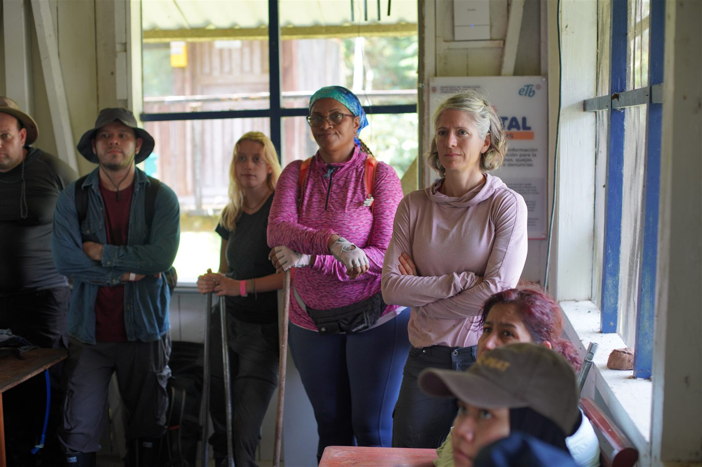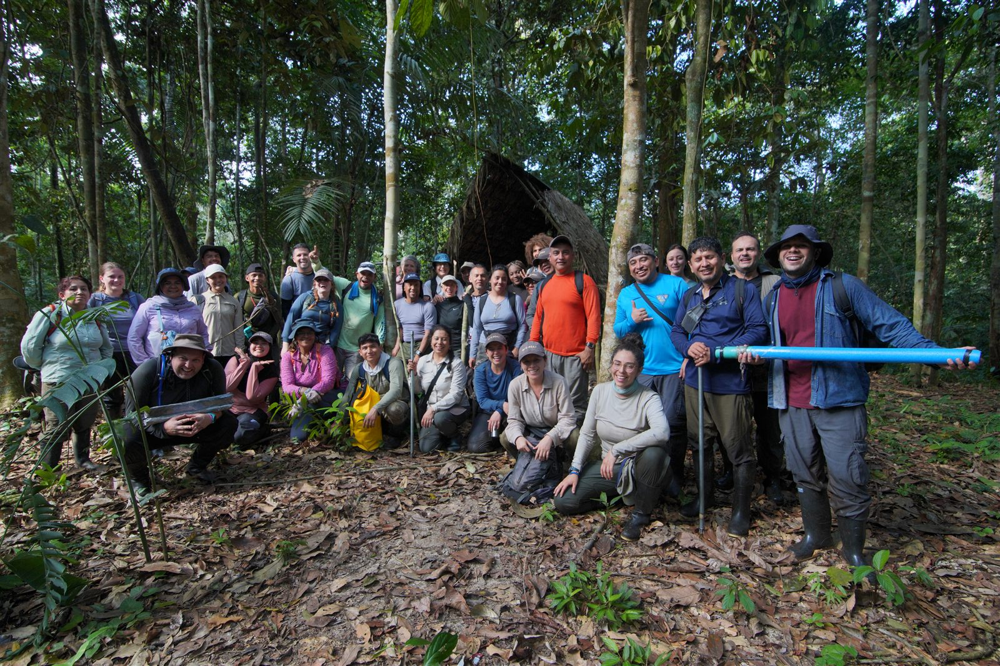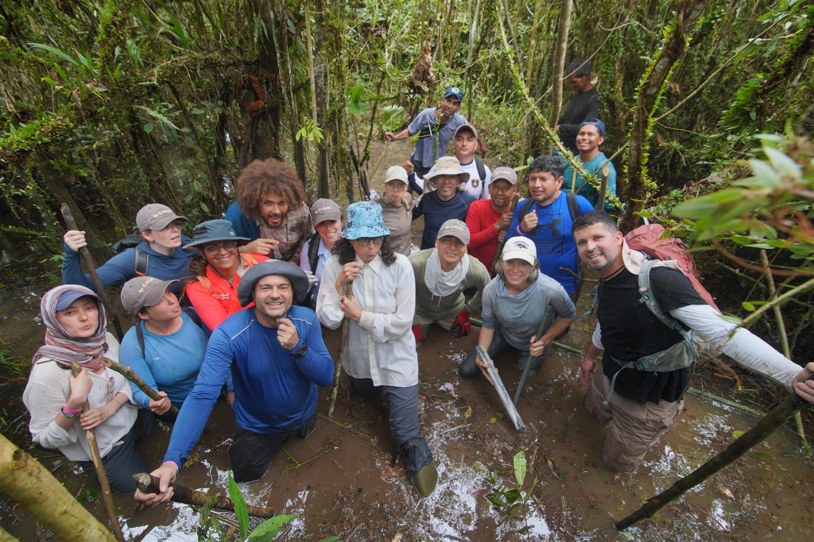

<label for="leticia-1" aria-label="Ver foto 1"></label><label for="leticia-2" aria-label="Ver foto 2"></label><label for="leticia-3" aria-label="Ver foto 3"></label>

    
Visita<h3>Leticia</h3>
Puerta de entrada al Amazonas y punto de encuentro para conectar conocimiento científico, territorio y comunidades.

Amazonas

  </article>
</a>

<a class="territory-card-link" href="santiago/">
  <article class="territory-card">
    
<input type="radio" name="gallery-santiago" id="santiago-1" checked><input type="radio" name="gallery-santiago" id="santiago-2"><input type="radio" name="gallery-santiago" id="santiago-3">
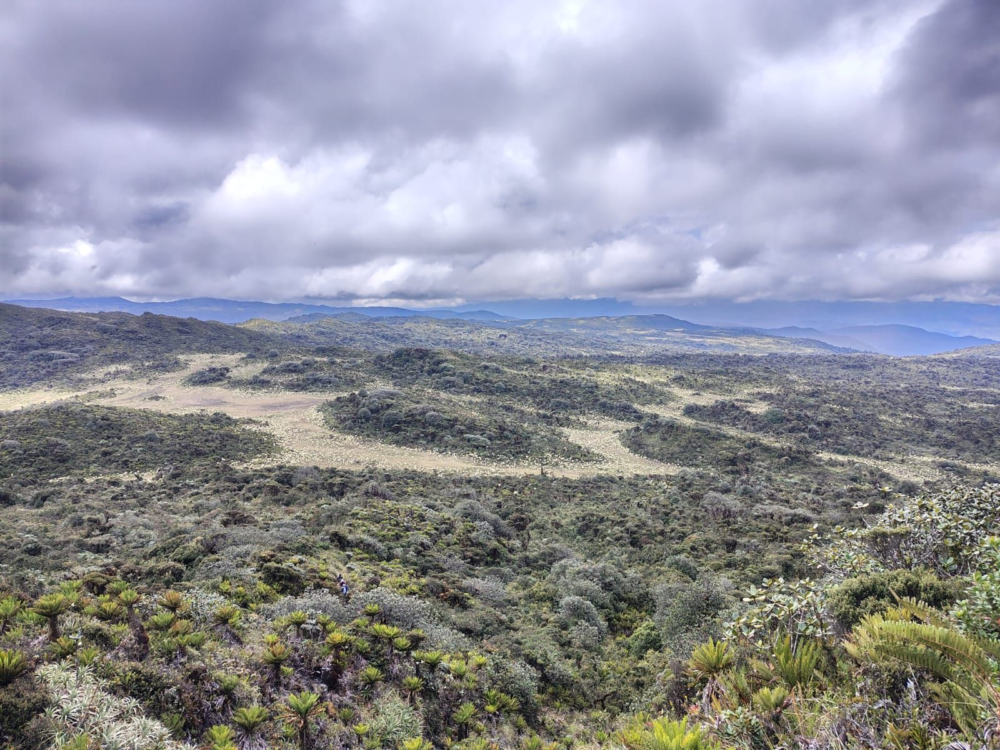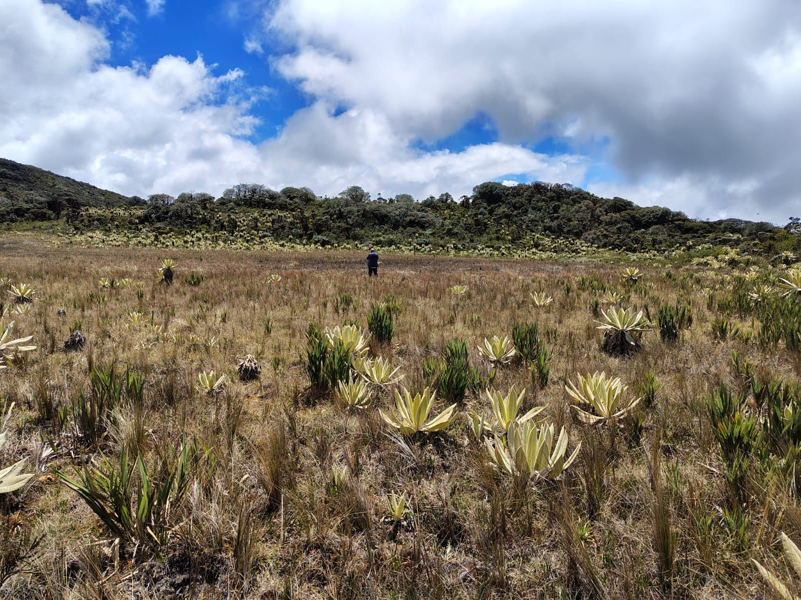

<label for="santiago-1" aria-label="Ver foto 1"></label><label for="santiago-2" aria-label="Ver foto 2"></label><label for="santiago-3" aria-label="Ver foto 3"></label>

    
Territorio<h3>Santiago</h3>
Un espacio para reconocer las prácticas locales y los ecosistemas que hacen parte de la red territorial de COLFLUX.

Putumayo

  </article>
</a>

<a class="territory-card-link" href="calamar/">
  <article class="territory-card">
    
<input type="radio" name="gallery-calamar" id="calamar-1" checked><input type="radio" name="gallery-calamar" id="calamar-2"><input type="radio" name="gallery-calamar" id="calamar-3">
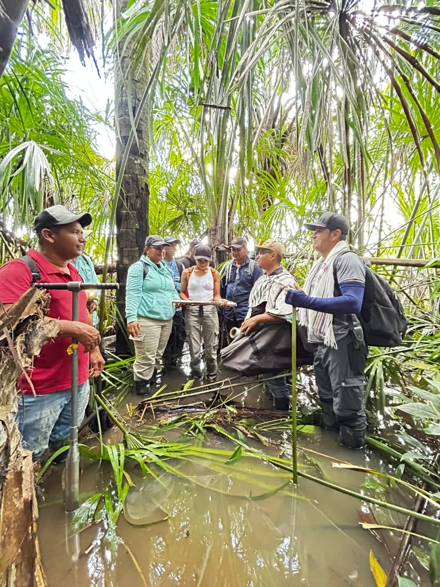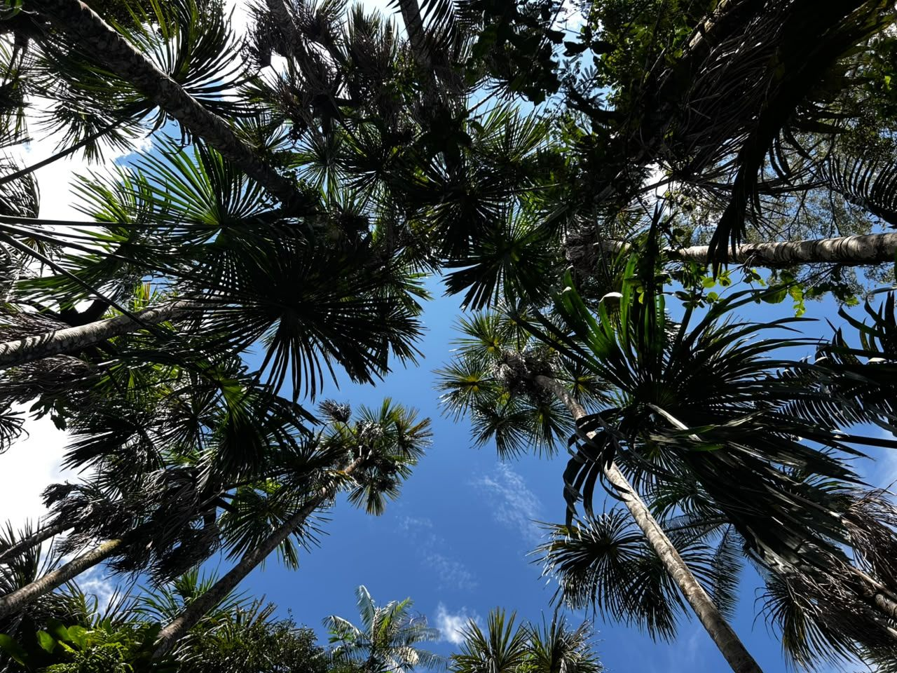

<label for="calamar-1" aria-label="Ver foto 1"></label><label for="calamar-2" aria-label="Ver foto 2"></label><label for="calamar-3" aria-label="Ver foto 3"></label>

    
Territorio<h3>Calamar</h3>
Territorio de transición amazónica donde se encuentran bosques, ríos y comunidades con saberes propios.

Guaviare

  </article>
</a>

<a class="territory-card-link" href="san-jose-del-guaviare/">
  <article class="territory-card">
    
<input type="radio" name="gallery-san-jose" id="san-jose-1" checked><input type="radio" name="gallery-san-jose" id="san-jose-2"><input type="radio" name="gallery-san-jose" id="san-jose-3">

<label for="san-jose-1" aria-label="Ver foto 1"></label><label for="san-jose-2" aria-label="Ver foto 2"></label><label for="san-jose-3" aria-label="Ver foto 3"></label>

    
Territorio<h3>San José del Guaviare</h3>
Un paisaje de encuentro entre la Amazonía y la Orinoquía, con comunidades y ecosistemas estratégicos.

Guaviare

  </article>
</a>

<a class="territory-card-link" href="inirida/">
  <article class="territory-card">
    
<input type="radio" name="gallery-inirida" id="inirida-1" checked><input type="radio" name="gallery-inirida" id="inirida-2"><input type="radio" name="gallery-inirida" id="inirida-3">
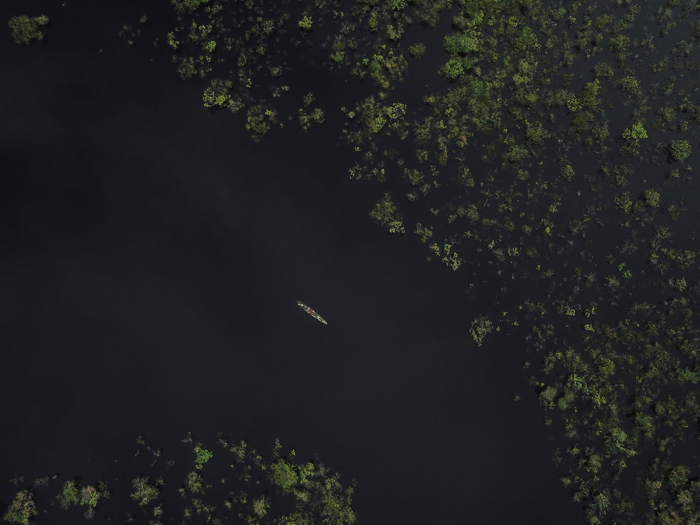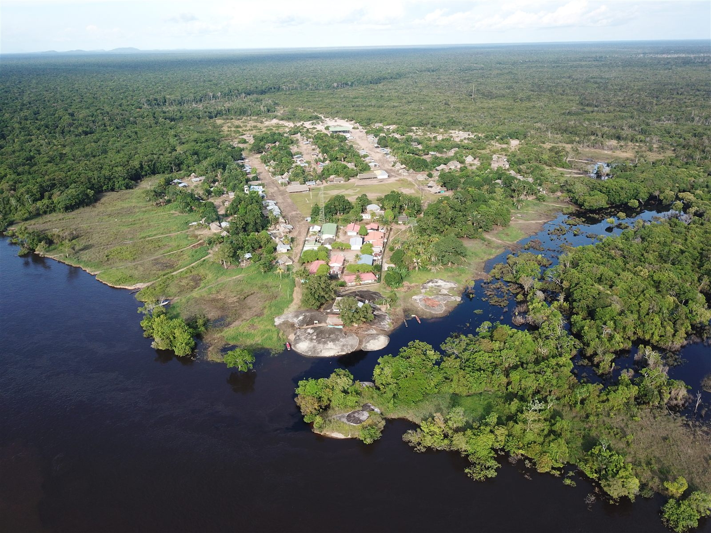

<label for="inirida-1" aria-label="Ver foto 1"></label><label for="inirida-2" aria-label="Ver foto 2"></label><label for="inirida-3" aria-label="Ver foto 3"></label>

    
Territorio<h3>Inírida</h3>
Territorio de ríos y sabanas amazónicas donde la biodiversidad y la cultura local orientan el diálogo.

Guainía

  </article>
</a>

<a class="territory-card-link" href="el-cocuy/">
  <article class="territory-card">
    
<input type="radio" name="gallery-cocuy" id="cocuy-1" checked><input type="radio" name="gallery-cocuy" id="cocuy-2"><input type="radio" name="gallery-cocuy" id="cocuy-3">
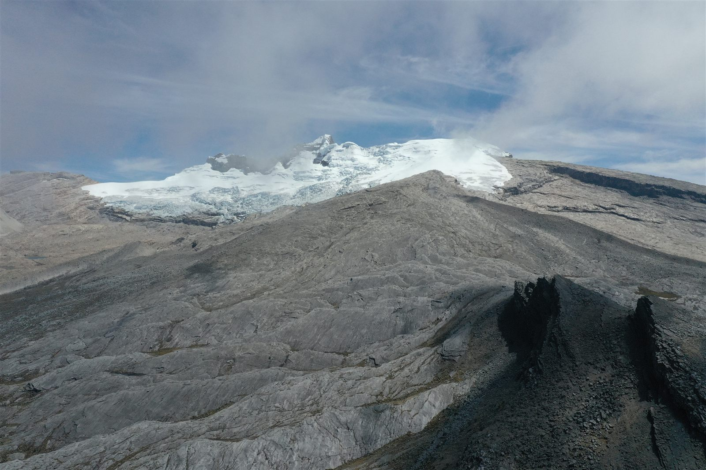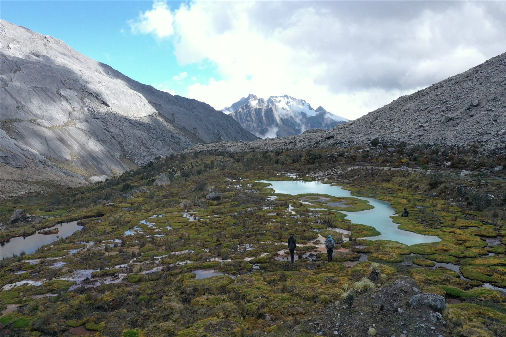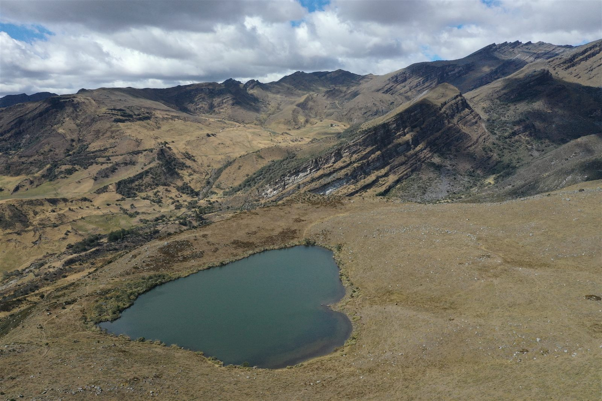

<label for="cocuy-1" aria-label="Ver foto 1"></label><label for="cocuy-2" aria-label="Ver foto 2"></label><label for="cocuy-3" aria-label="Ver foto 3"></label>

    
Visita<h3>El Cocuy</h3>
Paisajes de alta montaña que permiten conversar sobre páramos, agua y conservación con los actores locales.

Boyacá

  </article>
</a>

<a class="territory-card-link" href="guican-de-la-sierra/">
  <article class="territory-card">
    
<input type="radio" name="gallery-guican" id="guican-1" checked><input type="radio" name="gallery-guican" id="guican-2"><input type="radio" name="gallery-guican" id="guican-3">

<label for="guican-1" aria-label="Ver foto 1"></label><label for="guican-2" aria-label="Ver foto 2"></label><label for="guican-3" aria-label="Ver foto 3"></label>

    
Visita<h3>Güicán de la Sierra</h3>
Un territorio de páramo y montaña donde el cuidado del agua conecta el conocimiento local y científico.

Boyacá

  </article>
</a>

<a class="territory-card-link" href="choachi/">
  <article class="territory-card">
    
<input type="radio" name="gallery-choachi" id="choachi-1" checked><input type="radio" name="gallery-choachi" id="choachi-2"><input type="radio" name="gallery-choachi" id="choachi-3">
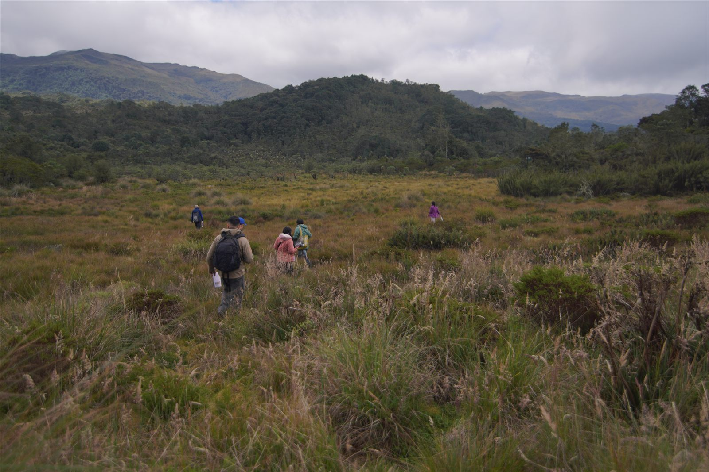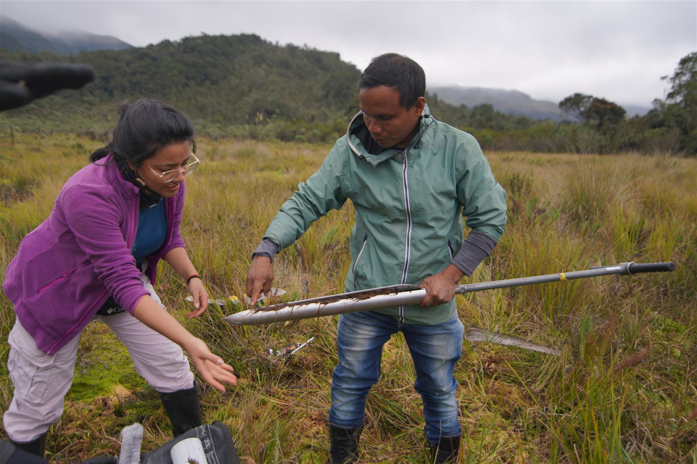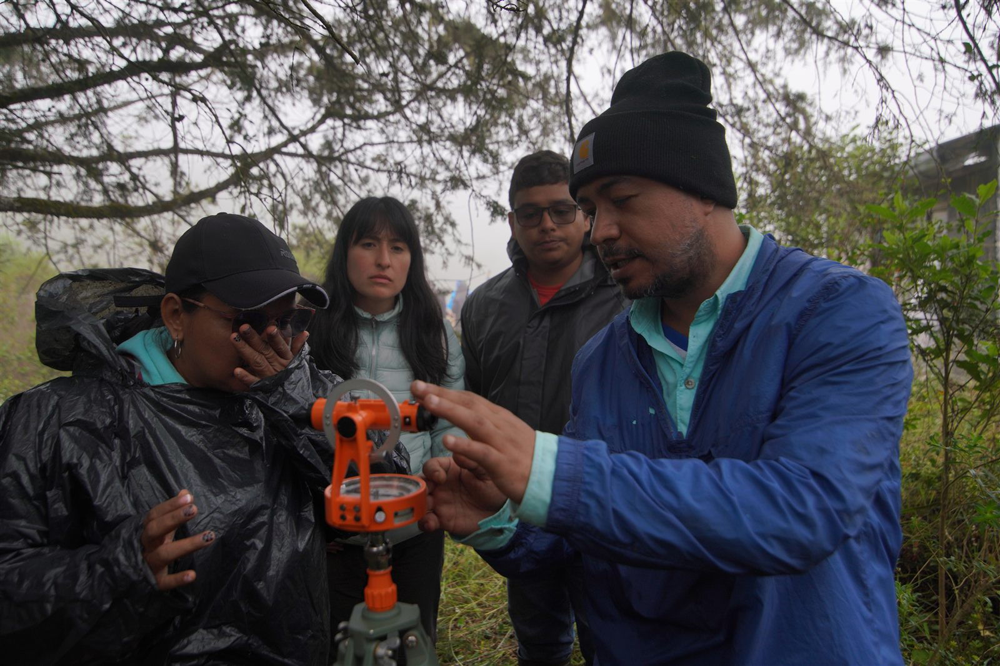

<label for="choachi-1" aria-label="Ver foto 1"></label><label for="choachi-2" aria-label="Ver foto 2"></label><label for="choachi-3" aria-label="Ver foto 3"></label>

    
Territorio<h3>Choachí</h3>
Montañas cercanas a Bogotá que muestran la relación entre ecosistemas altoandinos y comunidades rurales.

Cundinamarca

  </article>
</a>

<a class="territory-card-link" href="fomeque/">
  <article class="territory-card">
    
<input type="radio" name="gallery-fomeque" id="fomeque-1" checked><input type="radio" name="gallery-fomeque" id="fomeque-2"><input type="radio" name="gallery-fomeque" id="fomeque-3">

<label for="fomeque-1" aria-label="Ver foto 1"></label><label for="fomeque-2" aria-label="Ver foto 2"></label><label for="fomeque-3" aria-label="Ver foto 3"></label>

    
Territorio<h3>Fómeque</h3>
Un territorio de páramo, bosque y agua donde el diálogo con los actores locales es esencial.

Cundinamarca

  </article>
</a>

<a class="territory-card-link" href="la-calera/">
  <article class="territory-card">
    
<input type="radio" name="gallery-calera" id="calera-1" checked><input type="radio" name="gallery-calera" id="calera-2"><input type="radio" name="gallery-calera" id="calera-3">

<label for="calera-1" aria-label="Ver foto 1"></label><label for="calera-2" aria-label="Ver foto 2"></label><label for="calera-3" aria-label="Ver foto 3"></label>

    
Territorio<h3>La Calera</h3>
Un paisaje altoandino próximo a la capital, clave para comprender los vínculos entre agua, ciudad y ruralidad.

Cundinamarca

  </article>
</a>

<a class="territory-card-link" href="villavicencio/">
  <article class="territory-card">
    
<input type="radio" name="gallery-villavicencio" id="villavicencio-1" checked><input type="radio" name="gallery-villavicencio" id="villavicencio-2"><input type="radio" name="gallery-villavicencio" id="villavicencio-3">
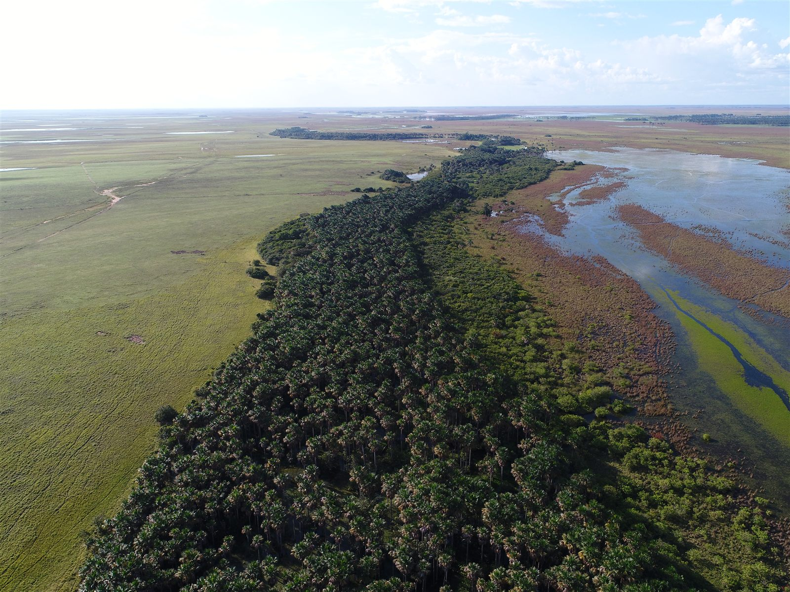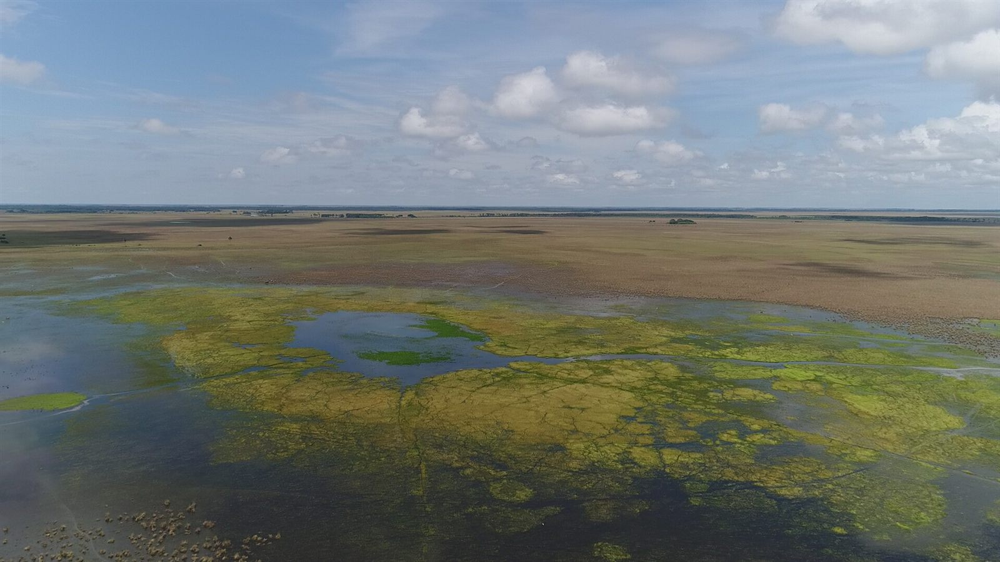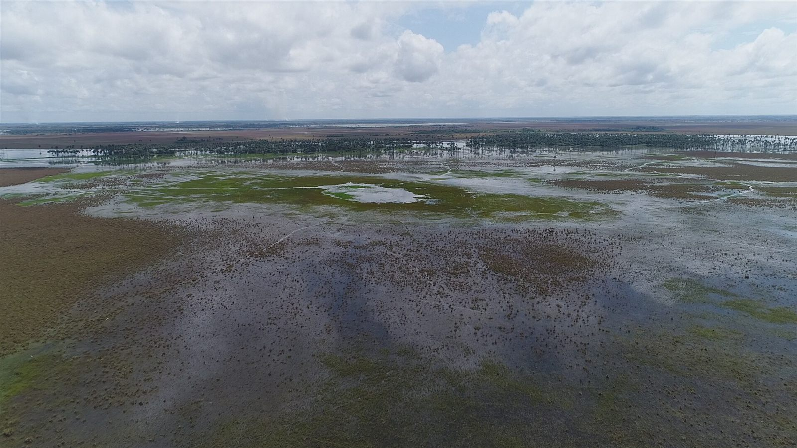

<label for="villavicencio-1" aria-label="Ver foto 1"></label><label for="villavicencio-2" aria-label="Ver foto 2"></label><label for="villavicencio-3" aria-label="Ver foto 3"></label>

    
Territorio<h3>Villavicencio</h3>
Puerta de la Orinoquía, donde confluyen paisajes de piedemonte, sabana y redes de trabajo territorial.

Meta

  </article>
</a>

<a class="territory-card-link" href="puerto-lleras/">
  <article class="territory-card">
    
<input type="radio" name="gallery-puerto-lleras" id="puerto-lleras-1" checked><input type="radio" name="gallery-puerto-lleras" id="puerto-lleras-2"><input type="radio" name="gallery-puerto-lleras" id="puerto-lleras-3">

<label for="puerto-lleras-1" aria-label="Ver foto 1"></label><label for="puerto-lleras-2" aria-label="Ver foto 2"></label><label for="puerto-lleras-3" aria-label="Ver foto 3"></label>

    
Visita<h3>Puerto Lleras</h3>
Sabana y ríos de la Orinoquía que permiten reconocer sus ciclos, biodiversidad y actividades productivas.

Meta

  </article>
</a>

<a class="territory-card-link" href="san-luis-de-palenque/">
  <article class="territory-card">
    
<input type="radio" name="gallery-san-luis" id="san-luis-1" checked><input type="radio" name="gallery-san-luis" id="san-luis-2"><input type="radio" name="gallery-san-luis" id="san-luis-3">

<label for="san-luis-1" aria-label="Ver foto 1"></label><label for="san-luis-2" aria-label="Ver foto 2"></label><label for="san-luis-3" aria-label="Ver foto 3"></label>

    
Visita<h3>San Luis de Palenque</h3>
Territorio llanero para conversar sobre sabanas inundables, biodiversidad y formas de vida locales.

Casanare

  </article>
</a>

