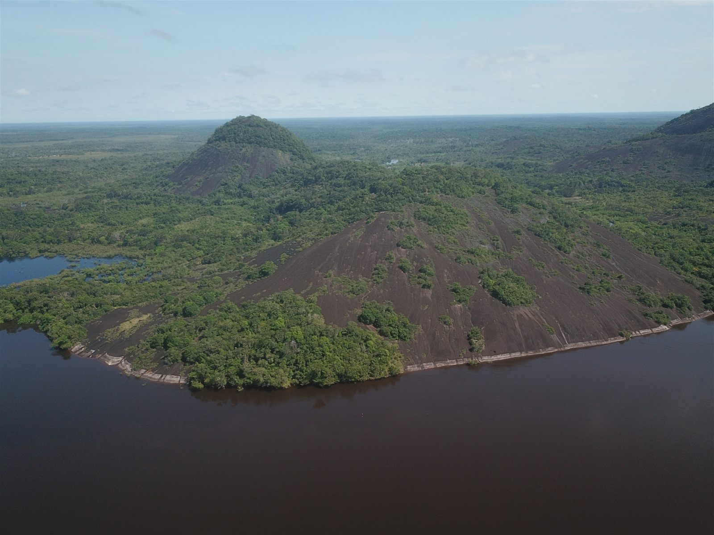

---
hide:
  - toc
---

# Inírida

  

    
    

      
Municipio de la Amazonía nororiental, capital del Guainía y punto de encuentro de ríos y humedales.

    

  

  

    
<strong>Tipo de entidad</strong>
Municipio, capital del departamento de Guainía.

    
<strong>Ubicación</strong>
Nororiente de la Amazonía colombiana, cerca de las fronteras con Venezuela y Brasil; corazón de la Estrella Fluvial de Inírida, donde confluyen los ríos Inírida, Guaviare, Atabapo y Ventuari para formar el Orinoco.

    
<strong>Clima</strong>
Cálido húmedo, temperatura promedio de 31,5 °C.

    
<strong>Biodiversidad</strong>
La Estrella Fluvial de Inírida es humedal Ramsar de importancia internacional (≈ 250.000 ha); alberga los Cerros de Mavicure (formaciones rocosas de 1.700 millones de años, entre las más antiguas del planeta) y las sabanas de arena blanca donde crece la flor de Inírida.

    
<strong>Economía</strong>
Comercio fluvial, turismo de naturaleza, pesca y minería artesanal.

    
<strong>Cultura y atractivos</strong>
Cerros de Mavicure, Piedra de Mavizo (miradores de atardecer), jardín de la flor de Inírida, petroglifos del parque rupestre Amarrú, turismo comunitario indígena.

    
<strong>Población</strong>
≈ 36.500 habitantes (DANE 2022, con crecimiento sostenido), municipio más poblado de Guainía; tres de cada cuatro habitantes del departamento son indígenas (14 pueblos, entre ellos puinave, curripaco, piapoco y cubeo).

  

  <a class="territory-back-link" href="../territorios/">← Volver a territorios</a>

