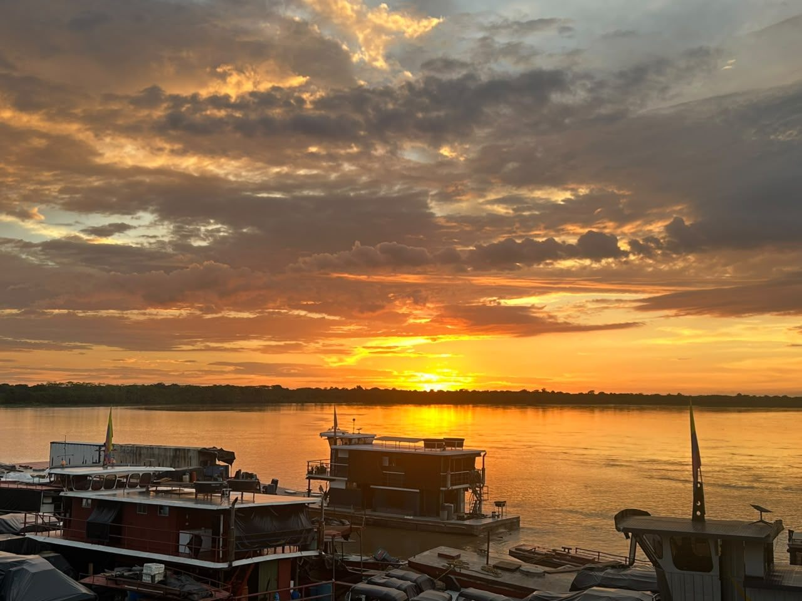

---
hide:
  - toc
---

# San José del Guaviare

  

    
    

      
Capital del departamento del Guaviare, en la confluencia entre la Amazonía y la Orinoquía.

    

  

  

    
<strong>Tipo de entidad</strong>
Municipio, capital del departamento del Guaviare.

    
<strong>Ubicación</strong>
Norte del departamento, en el límite entre la Orinoquía y la Amazonía, a orillas del río Guaviare.

    
<strong>Clima</strong>
Cálido tropical, temperatura promedio de 24 °C.

    
<strong>Biodiversidad</strong>
Cerca está la Serranía de La Lindosa, con el Cerro Azul y sus pictogramas milenarios; confluencia de ecosistemas de sabana, selva y afloramientos rocosos con alta diversidad de flora y fauna.

    
<strong>Economía</strong>
Ganadería, agricultura, turismo de naturaleza y comercio regional.

    
<strong>Cultura y atractivos</strong>
Parque de la Constitución (plaza principal), Cerro Azul, Ciudad de Piedra, caño Cristales de La Macarena (cercano), turismo comunitario indígena (jiw, tucano oriental, nukak).

    
<strong>Población</strong>
≈ 54.100 habitantes (DANE 2023), municipio más poblado del departamento.

  

  <a class="territory-back-link" href="../territorios/">← Volver a territorios</a>

