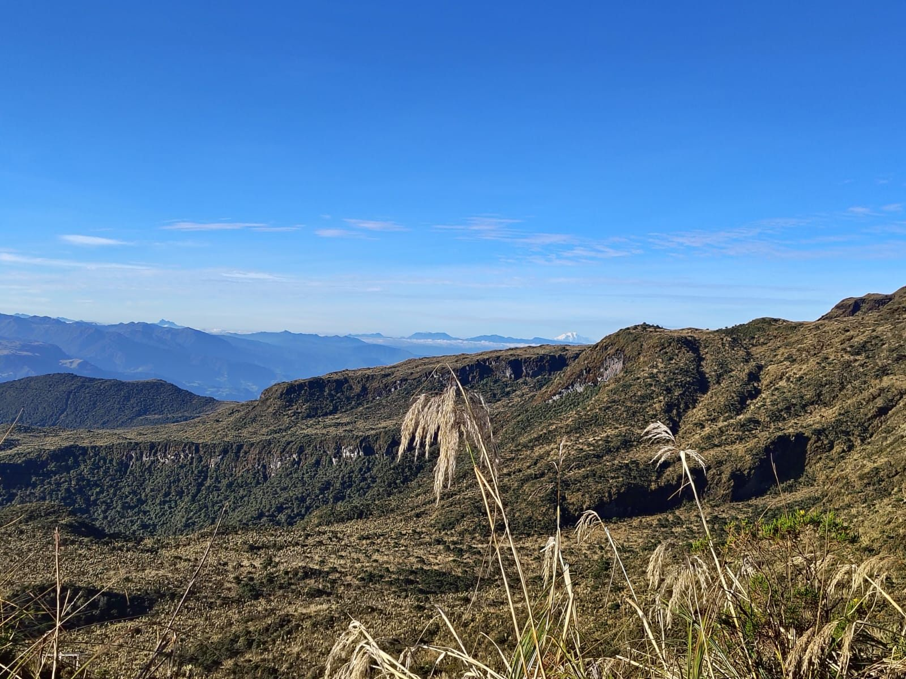

---
hide:
  - toc
---

# Santiago

  

    
    

      
Municipio del alto Putumayo, en el Valle de Sibundoy y rodeado por paisajes de montaña y páramo.

    

  

  

    
<strong>Tipo de entidad</strong>
Municipio.

    
<strong>Ubicación</strong>
Alto Putumayo, en el Valle de Sibundoy, cordillera de los Andes; limita con la Laguna de la Cocha (Nariño).

    
<strong>Extensión / altitud</strong>
Entre 2.000 y 4.000 msnm.

    
<strong>Clima</strong>
Frío de montaña y páramo.

    
<strong>Biodiversidad</strong>
Rodeado por el Páramo del Bordoncillo; el Putumayo en general alberga más de mil especies de aves (más del 50% del total de Colombia) y la mayor cantidad de especies de primates del país, con conectividad entre Andes, Amazonía y Orinoquía.

    
<strong>Economía</strong>
Agricultura de clima frío (papa, hortalizas), ganadería de leche y turismo rural.

    
<strong>Cultura y atractivos</strong>
Paisajes campesinos, senderos ecoturísticos, cercanía al corredor cultural indígena inga y kamëntsá del Valle de Sibundoy.

    
<strong>Población</strong>
≈ 7.300 habitantes (DANE 2023-2024).

  

  <a class="territory-back-link" href="../territorios/">← Volver a territorios</a>

